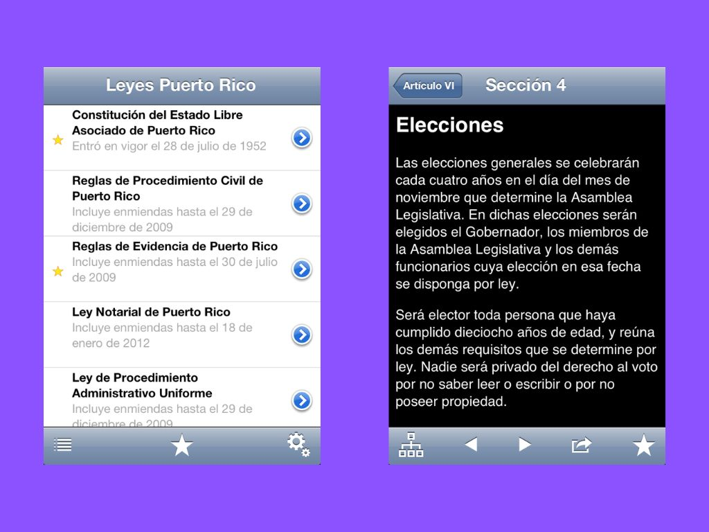

# Leyes PR (Puerto Rico Laws)

A legacy iOS application that provided convenient access to Puerto Rican legal codes and laws on iPad and iPhone devices. The app featured a comprehensive collection of legal documents including the Puerto Rico Constitution, Civil Code, Criminal Code, and various procedural rules.

## Features

- **Complete Legal Library**: Access to 12 major Puerto Rican legal codes including Constitution, Civil/Criminal codes, Evidence Rules, and more
- **Hierarchical Navigation**: Organized content structure allowing users to browse through legal sections and subsections
- **Search Functionality**: Full-text search across all legal documents with highlighting
- **Favorites System**: Bookmark important sections for quick reference
- **iPad Optimized**: Split-view interface designed for optimal reading on tablets
- **Content Sharing**: Email integration for sharing legal text

## Technical Overview

**Platform**: iOS (iPad/iPhone)  
**Language**: Objective-C  
**Architecture**: Model-View-Controller (MVC)  
**UI Framework**: UIKit with split-view controller pattern  

### Core Architecture

- **Data Model**: Hierarchical structure with Book and Section entities representing legal codes and their content
- **Content Storage**: Legal documents stored as property list files with efficient caching using NSCoding
- **Navigation**: Central SectionManager coordinates between list views and content display
- **UI Pattern**: Master-detail interface with book selection, section hierarchy, and content viewing

### Key Components

- Split-view controller optimized for iPad reading experience
- Custom table view cells for legal document navigation
- Web view integration with text highlighting for search results
- Favorites management with persistent storage
- Analytics integration via Localytics

## Screenshots

See the [Screenshots](./Screenshots) directory for additional app screenshots and interface examples.

## Project Status

This project is archived and represents a snapshot of iOS development practices from the early 2010s. The app was successfully published to the App Store and served the Puerto Rican legal community before being retired.

## Legal Codes Included

- **Constitución de Puerto Rico** - Constitution of Puerto Rico
- **Código Civil** - Civil Code
- **Código Penal** - Criminal Code
- **Reglas de Procedimiento Civil** - Rules of Civil Procedure
- **Reglas de Evidencia** - Rules of Evidence
- **Ley Notarial** - Notarial Law
- **Ley de Procedimiento Administrativo Uniforme** - Uniform Administrative Procedure Act
- **Reglas de Procedimiento Criminal** - Rules of Criminal Procedure
- **Ley de Violencia Doméstica** - Domestic Violence Law
- **Ley de Tránsito** - Traffic Law
- **Ley Electoral** - Electoral Law
- **ASUME** - Child Support Enforcement Administration (Administración para el Sustento de Menores)
